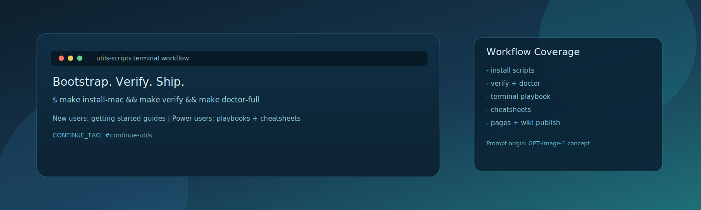

# utils-scripts



> A practical setup kit for terminal-first engineering: bootstrap faster, ship cleaner, and keep your daily workflow predictable.

[](LICENSE)
[](#supported-platforms)
[](https://buy.stripe.com/8x200i8bSgVe3Vl3g8bfO00)

## Why this exists

I rebuild environments often for delivery, demos, mentoring, and incident response.
This repository keeps that setup intentional and repeatable so you can:

- get to a working shell stack quickly (`zsh`, `starship`, `tmux`, `nvim`)
- use practical defaults for AI/ML-heavy work
- verify your machine setup before you lose time to edge-case breakages
- move from "new user" to "power user" with opinionated playbooks

If this project saves you setup time, your donation directly funds ongoing maintenance and docs updates.

## Docs Hub

- GitHub Pages docs: `docs/index.md` (published site)
- Wiki source for GitHub Wiki: `wiki/Home.md`
- Wiki mirror payload builder: `scripts/build_wiki_payload.sh`
- Workflow matrix: `docs/workflow-matrix.md`
- Quick command cards: `docs/top-10-new-user-commands.md`
- Terminal scenario playbook: `TERMINAL_PLAYBOOK.md`
- Power-user cheatsheets index: `docs/cheatsheets/index.md`

Special progress keyword for ongoing work across docs and release notes:

`CONTINUE_TAG: #continue-utils`

## Quick start

```bash
git clone https://github.com/dmoliveira/utils-scripts.git
cd utils-scripts
make help
make install-mac    # or: make install-debian / make install-unix
make verify
```

First five minutes after install:

```bash
exec zsh
make verify
make hooks-install
make pre-commit-install
make git-delta-config
make docs-browse
```

## Who should read what

### New users

1. `docs/getting-started.md`
2. `README.md` (this file)
3. `TERMINAL_PLAYBOOK.md`
4. `docs/top-10-new-user-commands.md`

### Power users

1. `docs/power-user.md`
2. `docs/cheatsheets/index.md`
3. `docs/troubleshooting.md`
4. `docs/top-10-power-user-commands.md`
5. `docs/top-10-release-maintainer-commands.md`

## What is included

| File | Purpose |
| --- | --- |
| `install_my_programs_debian` | Debian/Ubuntu installer |
| `install_my_programs_mac` | macOS installer (Homebrew based) |
| `install_my_programs_unix` | Generic Unix installer |
| `verify_post_install_unix` | Smoke checks after install |
| `doctor_post_install_unix` | Strict checks with fix hints |
| `verify_linux_edge_cases` | Linux command-variant checks |
| `bootstrap_shell_secrets` | Interactive shell secrets setup |
| `rollback_installer_backups` | Restore latest installer backups |
| `configure_git_delta` | Configure global git delta UX |
| `install_git_hooks` | Install local hooks |
| `run_commands/` | Shell/editor templates and helper functions |
| `docs/cheatsheets/*.md` | Command-by-command practical references |
| `.github/workflows/*` | CI checks + release/docs publishing workflows |

## Supported platforms

- Debian and Ubuntu
- macOS
- Other Unix flavors are best-effort

## Core commands

```bash
make verify
make verify-strict
make doctor
make ci-quick
make doctor-full
make release-precheck
make release-template-check
make release-docs-check
make workflow-inventory-check
make core-commands-check
make docs-assets-check
make cheatsheet-index-check
make quick-cards-check
make top10-cards-check
make ci-quick-guards-check
make verify-linux
make docs-browse
make wiki-build
make wiki-build-check
make wiki-source-check
make wiki-sidebar-check
make docs-hub-check
make docs-make-target-check
make continue-tag-check
make rollback-dry-run
make rollback
```

## Features by workflow stage

### Bootstrap

- installs terminal, editor, and productivity tooling
- applies baseline shell config templates with backups
- supports dry runs for low-risk previews

### Validate

- verifies required commands and expected config files
- checks shell/tmux/nvim startup integrity
- supports strict and JSON output modes for CI and automation

### Operate

- provides leader-pack shortcuts in `run_commands/my_zshrc`
- includes scenario-first playbooks in `TERMINAL_PLAYBOOK.md`
- includes per-tool cheatsheets for fast command recall

### Maintain

- lint and smoke workflows in GitHub Actions
- markdown link checks for `README.md` and `docs/`
- wiki source and payload link checks in smoke workflow
- golden path bootstrap retries apt/install steps for transient CI network issues
- golden path bootstrap has explicit job/install timeouts to prevent indefinite hangs
- golden path bootstrap uses concurrency cancellation to avoid stacked duplicate runs
- release-on-tag automation via `.github/workflows/release-on-tag.yml`
- docs publication workflow for Pages and Wiki
- workflow inventory: `.github/workflows/smoke-checks.yml`, `.github/workflows/link-check.yml`, `.github/workflows/docs-pages.yml`, `.github/workflows/wiki-sync.yml`, `.github/workflows/release-on-tag.yml`, `.github/workflows/release-e2e-check.yml`

## Configuration references

- Zsh template: `run_commands/my_zshrc`
- Tmux template: `run_commands/my_tmux.conf`
- Starship template: `run_commands/my_starship.toml`
- Neovim template: `run_commands/my_nvim_init.lua`
- Ghostty template: `run_commands/my_ghostty_config`
- WezTerm template: `run_commands/my_wezterm.lua`

## Troubleshooting quick picks

- if `verify_post_install_unix` fails in strict mode, run `make doctor`
- if command variants differ on Linux (`fd` vs `fdfind`, `bat` vs `batcat`), run `make verify-linux`
- if shell secrets are not loaded, run `make bootstrap-secrets` and ensure `chmod 600 ~/.config/secrets/shell.env`
- if you need rollback, run `make rollback-dry-run` first
- if `make shell-lint` fails with `mapfile: command not found`, update to latest release

Full troubleshooting guide: `docs/troubleshooting.md`

## Releases

Tags matching `v*` trigger `.github/workflows/release-on-tag.yml`.

```bash
git tag v1.2.0
git push origin v1.2.0
```

The release template is in `.github/RELEASE_NOTES_TEMPLATE.md`.

## Contributing

1. Fork the repo
2. Create a branch
3. Keep changes scoped and tested
4. Open a PR

Please keep scripts portable and avoid unnecessary dependencies.

## Support and connect

If this repo made your setup calmer, faster, or easier to maintain, consider donating:

[](https://buy.stripe.com/8x200i8bSgVe3Vl3g8bfO00)

Impact breakdown: `docs/donation-impact.md`

You can also connect here:

- CV: [dmoliveira.github.io/my-cv-public](https://dmoliveira.github.io/my-cv-public/)
- LinkedIn: [linkedin.com/in/dmztheone](https://www.linkedin.com/in/dmztheone/)

## License

This project is licensed under the GNU GPL-2.0 license.

Author: [Diego Marinho](https://github.com/dmoliveira)
